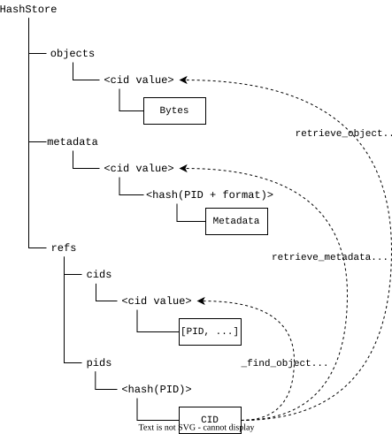

A folder structure is a directed acyclic graph (DAG), with nodes being either files or folders, and file paths identifying relationships. A [Merkle Tree](https://en.wikipedia.org/wiki/Merkle_tree) is a DAG with each leaf (file) labelled by a hash, and each non-leaf node (folder) labelled with the hash of the hashes it references. Computing a Merkle tree requires a depth first traversal of the folder hierarchy, computing the hashes of the folder contents, and computing the hash of the folder as the hash of its contained files or folders.

::: {#fig-vmdag_1 layout-ncol=3}

```
PID_1
├── A
│   ├── a1.txt
│   └── a2.txt
└── B
    └── b1.csv
```

```
0 dbc15 .
├── 0 ad5eb A
│   ├── 1 10fbd a1.txt
│   └── 1 c880c a2.txt
└── 0 cc08d B
    └── 1 00e99 b1.csv
```

```
dbc15 0 ad5eb A
dbc15 0 cc08d B
ad5eb 1 10fbd a1.txt
ad5eb 1 c880c a2.txt
cc08d 1 00e99 b1.csv
```

Initial state of VMDAG. The root of the first version is `dbc15`.
:::

A change to a folder hierarchy means that the hashes of the changed component and its parents are computed, resulting in a new hash for the root and the folders leading to the changed element.

::: {#fig-vmdag_2 layout-ncol=3}

```
PID_1
├── A
│   ├── a1.txt
│   └── a2.txt
└── B
    ├── b1.csv
    └── b2.csv
```

```
0 ed44a .
├── 0 ad5eb A
│   ├── 1 10fbd a1.txt
│   └── 1 c880c a2.txt
└── 0 a058e B
    ├── 1 00e99 b1.csv
    └── 1 40ebe b2.csv
```

```
dbc15 0 ad5eb A
dbc15 0 cc08d B
ad5eb 1 10fbd a1.txt
ad5eb 1 c880c a2.txt
cc08d 1 00e99 b1.csv
ed44a 0 ad5eb A
ed44a 0 a058e B
a058e 1 00e99 b1.csv
a058e 1 40ebe b2.csv
```

State of VMDAG after adding a file to folder B. The root of the new version is `ed44a`. The previous version is retained, with only changes being recorded.
:::

Assuming the bytes of the original content are preserved, the entire state of a version of the folder hierarchy can be retrieved given the hash of the root for the desired version. 

This approach is very efficient for recording changes to the tree, since only the changed folder and its parents need to be recorded. It is especially effective in an object store like `hashstore` which uses the content hashes to located content.

As elaborated below, `Folder` objects in `hashstore` could be stored as a single document for an entire folder hierarchy or as individual documents for each folder. Stored as individual folder objects, the second example would be:

::: {#fig-vmdag_2a}

```
          file dbc15 ◄────── PID_1     
          0 ad5eb A  ────┐             
    ┌──── 0 cc08d B      │             
    │                    │             
    │     file ad5eb ◄───┴──────────┐  
    │     1 10fbd a1.txt            │  
    │     1 c880c a2.txt            │  
    │                               │  
    └───► file cc08d                │  
          1 00e99 b1.csv            │  
                                    │  
          file ed44a ◄────── PID_2  │  
          0 ad5eb A  ───────────────┘  
    ┌──── 0 a058e B                    
    │                                  
    └───► file a058e                   
          1 00e99 b1.csv               
          1 40ebe b2.csv               
```

VMDAG as stored in `hashstore` as individual folder objects. Each folder object is stored as a file with the content hash as the name, and the root folder is referenced by a PID. The previous version of the root folder is retained and can be referenced by its PID.

:::


### Basic VMDAG operations

`store_folder(path)->list[FolderEntry]`
: Recursively compute the list of Merkle tree entries that represent the folder hierarchy. 

`retrieve_folder(hash) -> list[Path]`
: Given the hash of a folder (e.g. the root), recursively retrieve the labels (paths) for the entries.

`add(hash, path) -> list[FolderEntry]`
: Add a file or folder to the hierarchy identified by hash. Returns the list of generated entries.

`delete(hash, path) -> list[FolderEntry]`
: Remove a file or folder to the hierarchy identified by hash. Returns the list of generated entries.

`move(hash, path1, path2) -> list[FolderEntry]`
: Move a file or folder in the hierarchy identified by hash to a new location, includes renaming a file or folder. Returns the list of generated entries.

`apply_changes(version, changes:list[change])->list[FolderEntry]`
: Apply a set of changes to a version of the VMDAG. Changes include `add`, `delete`, and `move`. The result of applying a set of changes is a list of new entries. The recursive changes can be bundled so a number of changes can be made efficiently even on very large folder hierarchies, resulting in a single new version.

`list_versions() -> list[hash]`
: List the versions in the VMDAG, which is the list of hashes that refer to the hierarchy root.

`FolderEntry` is a structure with four elements:

```
class FolderEntry:
    ftype: int
    name: str
    hash: str
    folder_hash: str
```

For files, `ftype` = 1 and `hash` is the computed hash of the content. For folders, `ftype` = 0 and `hash` is the hash value computed from the list of entries in the folder, sorted by `ftype` and `name`. The `folder_hash` value is the hash of the containing folder, which is computed after the entries for the folder are known.

## Context

::: {#fig-context}

```{.plantuml}
!NEW_C4_STYLE=1
!include https://raw.githubusercontent.com/plantuml-stdlib/C4-PlantUML/master/C4_Context.puml
SHOW_PERSON_OUTLINE()

Person(user, "User", "Human user viewing, creating, or editing large datasets.")
System(service, "Data Service", "Automated service retrieving, adding, or altering content.", $sprite="robot")

System(cli, "Client Lib", "Command line application or client library.")
System_Boundary(metacats, "Metacat System") {
    System(metacatui, "Metacat UI")
    System(metacat, "Metacat")
}
System_Ext(d1, "DataONE")

Rel(user, cli, "Desktop interaction")
Rel(service, cli, "Application driven interactions")
Rel(user, metacatui, "Browser interaction")
Rel(metacatui, metacat, "API interaction")
Rel(cli, metacat, "API interaction")
Rel_R(metacat, d1, "Synchronize")
```

System context for large folder storage in DataONE.

:::

The implementation of VMDAGs is considered within the context of the DataONE and Metacat environment.

## Storing folders in `hashstore` using VMDAGs

::: {#fig-metacat}

```{.plantuml}
!NEW_C4_STYLE=1
!include https://raw.githubusercontent.com/plantuml-stdlib/C4-PlantUML/master/C4_Container.puml
SHOW_PERSON_OUTLINE()

title Metacat Application

Container(client, "Client")

System_Boundary(metacat, "Metacat") {
    Container(mc, "Metacat Application")
    ContainerDb(pg, "Postgres Database")
    ContainerDb(hs, "Hashstore")
}

Rel(mc, hs, "Stores object")
Rel(mc, pg, "Stores system metadata")
Rel_R(client, mc, "Interacts via API")
```

Basic elements of a Metacat application instance. Hashstore is where components of a dataset are stored.
:::

In `hashstore`, individual files are stored in files named by their content hash (CID), with additional files storing the association between persistent identifiers (PIDs) and corresponding CIDs. Multiple PIDs may reference a single CID. Content is immutable, and the hash store is only added to.

::: {#fig-hashstore}


Internal folder composition of a hashstore.
:::

A VMDAG can be stored in `hashstore` in two different ways without modification of the `hashstore` operations: 

1. by storing individual folders as files.
2. bundling the entries for a folder hierarchy into a single file.

Option 1 allows re-use of subfolder hierarchies between datasets[^any_folder] and requires consistent serialization of the folder objects (since the hash of the file itself is used as the `folder_hash` value). It does not allow for additional properties to be stored in the folder objects. 

[^any_folder]: Any hash within the merkle tree may be referenced, meaning any subfolder may have a PID.

Option 2 captures an entire hierarchy in a single file, may contain multiple revisions of a folder, and may contain additional properties for each entry. It does not (easily) allow for re-use of existing folder hierarchies.

Option 1 is probably preferable, especially if reuse of large static hierarchies is a goal.

Storage of large folder hierarchies with potentially millions of files will have significant operational implications if corresponding PIDs and System Metadata are required for each object. To avoid such a "PIDplosion", mechanisms for blob storage in hash store should be considered, where objects may have a CID only and perhaps inherit properties from a shared system metadata document or perhaps from statements in a resource map.

## Manipulating a folder hierarchy using a light weight client such as a browser


::: {#fig-metacatui}

```{.plantuml}
!NEW_C4_STYLE=1
!include https://raw.githubusercontent.com/plantuml-stdlib/C4-PlantUML/master/C4_Container.puml
SHOW_PERSON_OUTLINE()

Person(user, "User")

Container(browser, "Metacat UI")

System_Boundary(metacat, "Metacat") {
    Container(mc, "Metacat Application")
    ContainerDb(pg, "Postgres Database")
    ContainerDb(hs, "Hashstore")
}

Rel(user, browser, "Views and may edit datasets.")
Rel(mc, hs, "Stores object")
Rel(mc, pg, "Stores system metadata")
Rel_R(browser, mc, "Interacts via API")
```

Users may view and edit datasets using the Metacat UI web application with highly constrained resources. A user may want to navigate a large dataset containing millions of files and edit the dataset by adding files. 
:::

Assuming content is being accessed from a `hashstore` using option 1 for VMDAG storage, a browser client may read a folder hierarchy by retrieving the top level folder (identified by a PID), an recursing into the folder hierarchy as desired. A browser client will typically only show a small portion of a large folder hierarchy, and so the number of request to retrieve the information will be limited (essentially retrieving the relevant subfolder entries).

A browser client has the benefit of complete control over "file system" semantics, since content is sandboxed and requires client facing API operations for manipulation. A client may mutate an existing folder hierarchy through atomic `add`, `delete`, and `move` operations, or preferably by `apply_changes` to bundle the changes to create the new version. In addition to any files added, the bundled operation will result in several folder objects (one for each level from the altered leaf to the root) being uploaded to hash store and a single new PID for the root.

While the `apply_changes` operation could be implemented on the server side, it can be also done efficiently client side since all the information necessary to compute the new folder objects (i.e. the folder objects between root and the altered leaf / leaves) was already retrieved by the client.

::: {#fig-vmdag_3 layout-ncol=3}

```
PID_1
├── A
│   ├── a1.txt
│   └── a2.txt
└── B
    ├── b1.csv
    └── b2.csv  **
```

```
0 ed44a .  **
├── 0 ad5eb A
│   ├── 1 10fbd a1.txt
│   └── 1 c880c a2.txt
└── 0 a058e B  **
    ├── 1 00e99 b1.csv
    └── 1 40ebe b2.csv  **
```

```
dbc15 0 ad5eb A
dbc15 0 cc08d B
ad5eb 1 10fbd a1.txt
ad5eb 1 c880c a2.txt
cc08d 1 00e99 b1.csv
ed44a 0 ad5eb A         **
ed44a 0 a058e B         **
a058e 1 00e99 b1.csv    **
a058e 1 40ebe b2.csv    **
```

A browser client can efficiently alter a VMDAG folder presentation since only the changes (denoted by "`**`") need to be propagated to the origin. In this case, adding a file to folder B means tha the file `b2.csv` and the four new entries in the VMDAG need to be uploaded.
:::


## Manipulating a folder hierarchy using a heavy client from a desktop or server 

::: {#fig-datapack}

```{.plantuml}
!NEW_C4_STYLE=1
!include https://raw.githubusercontent.com/plantuml-stdlib/C4-PlantUML/master/C4_Container.puml
SHOW_PERSON_OUTLINE()

Person(user, "User", $sprite=robot)

Container(cli, "Application with VMDAG library")

System_Boundary(metacat, "Metacat") {
    Container(mc, "Metacat Application")
    ContainerDb(pg, "Postgres Database")
    ContainerDb(hs, "Hashstore")
}

Rel(user, cli, "Create, edit, retrieve datasets.")
Rel(mc, hs, "Stores object")
Rel(mc, pg, "Stores system metadata")
Rel_R(cli, mc, "Interacts via API")
```

A heavy client may create and mutate very large datasets containing millions of files. The dataset needs to be efficiently uploaded to Metacat and changes efficiently propagated.
:::


A desktop or server client has direct access to the file system and presumably the entire original folder hierarchy (or may retrieve it). In such environments, multiple processes may alter folder and file content in ways without any knowledge of the associated VMDAG. There are multiple options for tracking file and folder mutation for updating a VMDAG:

1. Recompute the MDAG for each version. The simplest approach which would be fine for relatively small hierarchies (hundreds of files), but could get expensive as the managed hierarchy grows.

2. File tagging. Each file and folder can be assigned a persistent unique identifier (like a SID in DataONE) as an extended attribute. The xattr will remain attached to the file through mutations and moves, and could thus provide the basis for computing the change operations for a new MDAG version. 

3. File system hooks. Requires file system level operations to trigger additional calls to perform corresponding VMDAG operations. This could be implemented in FUSE for example, but cross platform implementation may be more involved (e.g. FUSE for linux, MacOS; WinFsp for Windows).

4. Watcher. A file system watcher such as `watchdog` can be efficient and work cross platform, though changes that occurred when the watch service was not running would be missed, and so would require a complete recalculation of the folder hierarchy which could be expensive for large hierarchies.

Recommendation is to implement option 1 and extend to option 2 when needed.

Core operations of a command line client may be conceptually similar to a `git` session. For example using a cli called "dpack":

```bash
# Create framework for managing a dataset identified by the PID dataset_PID. Creates
# an ORE document and initializes tracking components for the vmdag. Sets up a
# default system metadata template for components.
dpack init dataset_PID

# Add a metadata document with identifier PID. Adds to the ORE
dpack add metadata.xml PID

# Register a folder as a dataset component identified by ds_PID
dpack add folder_name ds_PID

# Adds relationship in ORE
dpack relation PID documents ds_PID

# Create a version. Generates the VMDAG Folder objects.
dpack commit

# Push the package to member node
# Uploads the metadata, ORE, dataset files, and Folder objects
dpack publish
```